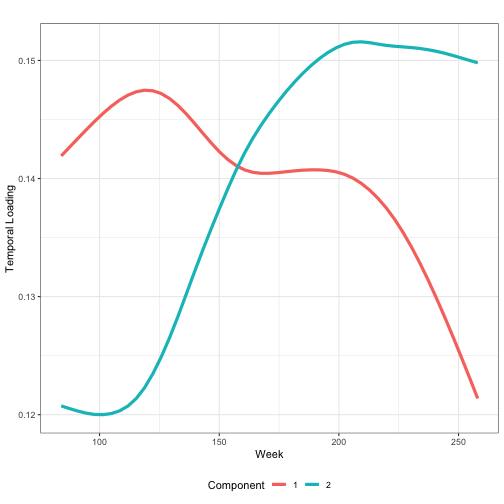
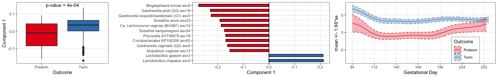
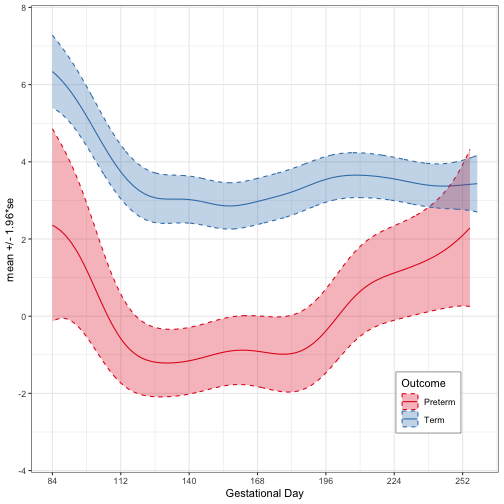
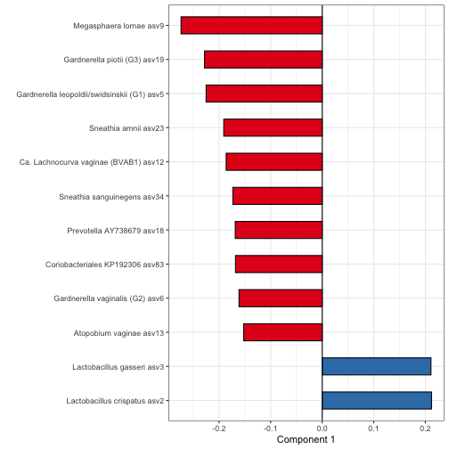
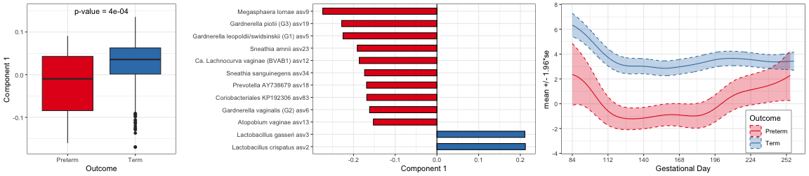

# Preparation

## Library


```r
rm(list=ls())
# for data
library(qiime2R) # read in Qiime artifacts
library(dplyr) # data formatting
library(tidyverse) # data formatting
# for computing
library(reticulate) # run py codes
library(vegan) # distance matrix
library(PERMANOVA) # permanova
library(randomForest) # random forest
library(PRROC) # roc and pr
library(phyloseq) # phyloseq object

# for plotting
library(ggpubr)
library(ggplot2)
library(gridExtra)
library(RColorBrewer)

# set working directory to be where the current script is located
setwd(dirname(rstudioapi::getSourceEditorContext()$path))

source('../TEMPTED.R')
color_RB <- brewer.pal(3,'Set1')[1:2]
```


## Read in the count data and meta data 


```r
# Get data in 2nd and 3rd trimester
load("data/data_post.RData")
metadata_all <- post.df %>% 
  filter(DayVsDel < 0, LibrarySize >= 4e4, PregOut!="Miscarriage") %>%
  dplyr::select(Cohort, SampleID, PregID, DayVsConc, DayVsDel, PregOut, GDdel) %>%
  group_by(PregID) %>% filter(n() > 1) %>% ungroup()
head(metadata_all)
```

```
## # A tibble: 6 × 7
##   Cohort SampleID        PregID      DayVsConc DayVsDel PregOut GDdel
##   <chr>  <chr>           <chr>           <dbl>    <dbl> <chr>   <int>
## 1 SU     1010101108.IL18 10001.Preg2         1     -257 Preterm   258
## 2 SU     1010101118.IL18 10001.Preg2         7     -251 Preterm   258
## 3 SU     1010101128.IL18 10001.Preg2        13     -245 Preterm   258
## 4 SU     1010101158.IL18 10001.Preg2        36     -222 Preterm   258
## 5 SU     1010101168.IL18 10001.Preg2        43     -215 Preterm   258
## 6 SU     1010101178.IL18 10001.Preg2        49     -209 Preterm   258
```

```r
metadata <- metadata_all %>% filter(DayVsConc >= 12*7, DayVsConc < 37*7)
ps_filtered <- prune_samples(metadata$SampleID, post.ps)
ps_filtered <- filter_taxa(ps_filtered, function(x) sum(x!=0) >= 5, TRUE)
count_tab <- data.frame(otu_table(ps_filtered))
meta_tab <- data.frame(sample_data(ps_filtered))
```


## Plot timeline of study


```r
meta_ordered <- metadata_all %>%
  arrange(PregOut, GDdel) %>% 
  mutate(PregID=factor(PregID, levels=unique(PregID)))
p_timeline <- ggplot(data=meta_ordered, 
       aes(x=DayVsConc, y=PregID, 
           PregOut=as.factor(PregID), color=PregOut, shape=PregOut)) +
  geom_line() + 
  geom_point()  + 
  scale_color_manual(values=color_RB) +
  labs(y="Host ID", x="Gestational Day", color="Outcome", shape="Outcome") + 
  theme_bw() +
  theme(legend.position="bottom") + 
  scale_x_continuous(breaks=seq(from=84,to=294,by=28)) +
  theme(axis.text.y=element_blank(),
        axis.ticks.y=element_blank(),
        panel.grid.minor = element_blank(),
        panel.grid.major = element_blank()) +
  geom_vline(xintercept=c(12,37)*7, linetype="dashed")
pdf('../figure_table/vaginal_Stanford_timeline.pdf', width=11.5, height=7.5)
print(p_timeline)
dev.off()
```

```
## quartz_off_screen 
##                 2
```


# TEMPTED

## Run TEMPTED


```r
datlist_conc <- format_tempted(count_tab, meta_tab$DayVsConc, meta_tab$PregID, 
                              threshold=0.95, pseudo_count=0.5, transform='clr')
datlist_raw_conc <- format_tempted(count_tab, meta_tab$DayVsConc, meta_tab$PregID, 
                                  threshold=0.95, transform='none')
npc <- 2
svd_conc <- svd_centralize(datlist_conc, 1)
res_tempted_conc <- tempted(svd_conc$datlist, r = npc, resolution = 51, smooth=1e-3)
```

```
## [1] "Calculate the 1th Component"
## [1] "Convergence reached at dif=6.854664197614e-05, iter=5"
## [1] "Calculate the 2th Component"
## [1] "Convergence reached at dif=7.80060039234733e-05, iter=5"
```

```r
save(ps_filtered, 
     svd_conc, res_tempted_conc, datlist_conc, datlist_raw_conc,
     file='result/res_delivery_tempted.Rdata')


load('result/res_delivery_tempted.Rdata')
count_tab <- data.frame(otu_table(ps_filtered))
meta_tab <- data.frame(sample_data(ps_filtered))
res_tempted <- res_tempted_conc
svd_tempted <- svd_conc
datlist <- datlist_conc
datlist_raw <- datlist_raw_conc
npc <- 2
```


## Plot time loading


```r
p_time <- plot_time_loading(res_tempted, r=npc) +
  labs(x='Week', y="Temporal Loading", title=" ", color="Component") + 
  geom_line(size=1.5) + theme_bw() + 
  theme(legend.position='bottom')
p_time
```




## Plot subject loadings


```r
metauni <- unique(meta_tab[,c('PregID', 'PregOut')])
rownames(metauni) <- metauni$PregID
table(metauni$PregOut)
```

```
## 
## Preterm    Term 
##      49     141
```

```r
table(meta_tab$PregOut)
```

```
## 
## Preterm    Term 
##     563    2262
```

```r
A.hat <- metauni
rownames(A.hat) <- A.hat$PregID
table(rownames(A.hat)==rownames(res_tempted$A.hat))
```

```
## 
## TRUE 
##  190
```

```r
A.hat <- cbind(res_tempted$A.hat[,1:npc], A.hat)
A.hat$PregOut <- as.factor(A.hat$PregOut)

pval <- round(wilcox.test(A.hat$`Component 1`~A.hat$PregOut)$p.value,4)
pval
```

```
## [1] 4e-04
```

```r
p_sub_box <- ggplot(A.hat) + 
  geom_boxplot(aes(x=PregOut, y=`Component 1`, fill=PregOut)) + 
  theme_bw() + scale_fill_manual(values=color_RB) + 
  labs(x="Outcome") + 
  theme(legend.position="none") +
  annotate("text", x=1.5, y=0.15, label= paste0("p-value = ", pval))
p_sub_box
```



## Plot trajectory of log ratio of total abundance of top features


```r
ratio_feat <- ratio_feature(res_tempted, datlist_raw, pct=0.05,
                            absolute=TRUE)

## summed up, by individual subject

tab_feat_ratio <- ratio_feat$metafeature.ratio
colnames(tab_feat_ratio)[2] <- 'PregID'
tab_feat_ratio <- merge(tab_feat_ratio, metauni)

## summed up, by mean and sd
reshape_feat_ratio <- reshape(tab_feat_ratio, 
                              idvar=c("PregID","timepoint") , 
                              v.names=c("value"), timevar="PC",
                              direction="wide")
CC <- grep('Component',colnames(reshape_feat_ratio))
colnames(reshape_feat_ratio)[CC] <- paste('Component', 1:npc)
feature_mat_ratio <- reshape_feat_ratio[,CC]
colnames(feature_mat_ratio) <- paste("Component", 1:npc)


time_vec_ratio <- reshape_feat_ratio$timepoint
group_vec_ratio <- factor(reshape_feat_ratio$PregOut)
p_feat_ratio_summary <- plot_feature_summary(feature_mat_ratio, 
                                             time_vec_ratio, 
                                             group_vec_ratio, bws=12, nrow=1)
feature_mat_ratio1 <- feature_mat_ratio[,1,drop=FALSE]
colnames(feature_mat_ratio1) <- "Component 1"
p_feat_ratio_summary <- plot_feature_summary(feature_mat_ratio1, 
                                             time_vec_ratio, 
                                             group_vec_ratio, bws=12, nrow=1) + 
  xlab('Gestational Day') + theme_bw() + 
  theme(legend.position=c(0.85,0.15), 
        legend.background = element_rect(fill="white", size=0.2, linetype="solid", 
                                                                     colour ="black")) + 
  scale_fill_manual("Outcome", values=color_RB) +
  scale_color_manual("Outcome", values=color_RB) +
  scale_x_continuous(breaks=seq(from=84,to=294,by=28)) + ylim(c(-3.5, 7.5))+
  theme(strip.text = element_blank(), 
        strip.background = element_blank())
p_feat_ratio_summary
```




## Bar plot of top feature loading 


```r
# taxanomic information of top and bottom bacteria
sum(ratio_feat$toppct[,1])
```

```
## [1] 2
```

```r
sum(ratio_feat$bottompct[,1])
```

```
## [1] 10
```

```r
tab_taxa <- rbind(tax_table(ps_filtered)[names(which(ratio_feat$toppct[,1])),],
tax_table(ps_filtered)[names(which(ratio_feat$bottompct[,1])),])
tab_taxa <-as.data.frame(tab_taxa)
tab_taxa$loading_PC1 <- res_tempted$B.hat[rownames(tab_taxa),1]
write.csv(tab_taxa, file="../figure_table/vaginal_Stanford_topfeat.csv")
rownames(tab_taxa) <- NULL
tab_taxa
```

```
##     Kingdom         Phylum          Class             Order
## 1  Bacteria     Firmicutes        Bacilli   Lactobacillales
## 2  Bacteria     Firmicutes        Bacilli   Lactobacillales
## 3  Bacteria     Firmicutes  Negativicutes   Selenomonadales
## 4  Bacteria Actinobacteria Actinobacteria Bifidobacteriales
## 5  Bacteria Actinobacteria Actinobacteria Bifidobacteriales
## 6  Bacteria Actinobacteria Actinobacteria Bifidobacteriales
## 7  Bacteria Actinobacteria Coriobacteriia  Coriobacteriales
## 8  Bacteria Actinobacteria Coriobacteriia  Coriobacteriales
## 9  Bacteria     Firmicutes     Clostridia     Clostridiales
## 10 Bacteria  Bacteroidetes    Bacteroidia     Bacteroidales
## 11 Bacteria   Fusobacteria  Fusobacteriia   Fusobacteriales
## 12 Bacteria   Fusobacteria  Fusobacteriia   Fusobacteriales
##                Family          Genus  monoSpecies
## 1    Lactobacillaceae  Lactobacillus         <NA>
## 2    Lactobacillaceae  Lactobacillus         <NA>
## 3     Veillonellaceae    Megasphaera         <NA>
## 4  Bifidobacteriaceae    Gardnerella    vaginalis
## 5  Bifidobacteriaceae    Gardnerella    vaginalis
## 6  Bifidobacteriaceae    Gardnerella    vaginalis
## 7        Atopobiaceae      Atopobium      vaginae
## 8     Eggerthellaceae       DNF00809         <NA>
## 9     Lachnospiraceae Shuttleworthia         <NA>
## 10     Prevotellaceae     Prevotella         <NA>
## 11   Leptotrichiaceae       Sneathia         <NA>
## 12   Leptotrichiaceae       Sneathia sanguinegens
##                                                                                  multSpecies
## 1                              acidophilus/casei/crispatus/gallinarum/helveticus/kitasatonis
## 2  crispatus/gasseri/helveticus/hominis/iatae/johnsonii/kefiranofaciens/prophage/taiwanensis
## 3                                                                                       <NA>
## 4                                                                                  vaginalis
## 5                                                                                  vaginalis
## 6                                                                                  vaginalis
## 7                                                                                    vaginae
## 8                                                                                       <NA>
## 9                                                                                       <NA>
## 10                                                                                      <NA>
## 11                                                                        amnii/sanguinegens
## 12                                                                              sanguinegens
##                              lactSpecies asvNum
## 1       acidophilus/crispatus/gallinarum   asv2
## 2  gasseri/hominis/johnsonii/taiwanensis   asv3
## 3                                   <NA>   asv9
## 4                                   <NA>   asv6
## 5                                   <NA>  asv19
## 6                                   <NA>   asv5
## 7                                   <NA>  asv13
## 8                                   <NA>  asv83
## 9                                   <NA>  asv12
## 10                                  <NA>  asv18
## 11                                  <NA>  asv23
## 12                                  <NA>  asv34
##                                         asvLab     Count loading_PC1
## 1                 asv2 Lactobacillus crispatus 144886893   0.2120502
## 2                   asv3 Lactobacillus gasseri  51647164   0.2108700
## 3                      asv9 Megasphaera lornae  14062876  -0.2738389
## 4              asv6 Gardnerella vaginalis (G2)  15469825  -0.1614649
## 5                asv19 Gardnerella piotii (G3)   4336844  -0.2283291
## 6  asv5 Gardnerella leopoldii/swidsinskii (G1)  17199447  -0.2251828
## 7                      asv13 Atopobium vaginae   6792536  -0.1523587
## 8              asv83 Coriobacteriales KP192306    491928  -0.1682556
## 9        asv12 Ca. Lachnocurva vaginae (BVAB1)   7624591  -0.1862995
## 10                   asv18 Prevotella AY738679   4622531  -0.1687090
## 11                        asv23 Sneathia amnii   3260610  -0.1910104
## 12                 asv34 Sneathia sanguinegens   1695959  -0.1734311
```

```r
# barplot
tab_taxa <- tab_taxa %>% mutate(outcome=ifelse(loading_PC1<0,"Preterm","Term"))
tab_taxa$label <- paste0(substring(tab_taxa$asvLab, 6, 50), " ",
                               tab_taxa$asvNum)
tab_taxa <- tab_taxa %>% arrange(-loading_PC1)
tab_taxa$label <- factor(tab_taxa$label, levels=unique(tab_taxa$label))

p_bar <- tab_taxa %>% 
  ggplot(aes(x=label, y=loading_PC1)) + 
  geom_bar(stat="identity", colour="black", width = 0.5, aes(fill = outcome)) + 
  geom_hline(yintercept = 0) +
  theme_bw() +
  scale_fill_manual(values=color_RB) +
  coord_flip() + 
  labs(y = "Component 1", x = "") + 
  theme(legend.position="none")

p_bar
```




```r
lay <- matrix(c(1,1,2,2,2,2,3,3,3),1,)
p_all <- grid.arrange(p_sub_box, p_bar, p_feat_ratio_summary, layout_matrix=lay)
```



```r
ggsave('../figure_table/vaginal_Stanford_plot.pdf', width=16, height=3.5, plot=p_all)
```

